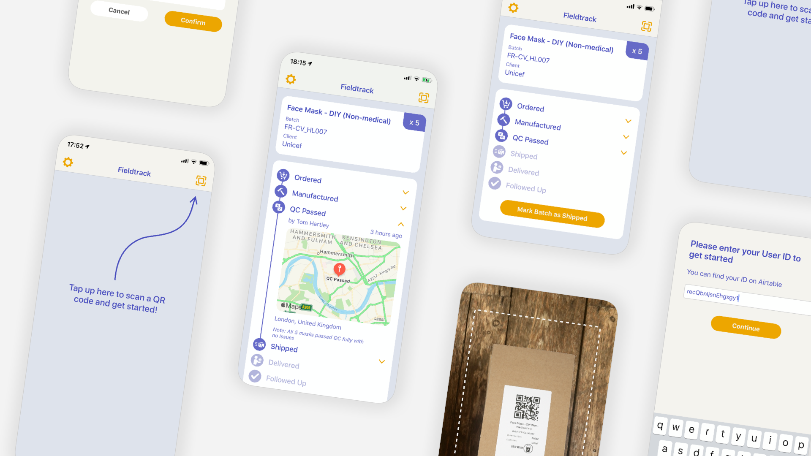

# FieldTrack
FieldTrack is a tracking system for Field Ready's products, developed with the support of the Hackaday Prize Dream Team program in Summer 2020.

This is an iOS app, with full autolayout support ensuring the layout scales for all devices that can run iOS 13, including everything from the old iPhone SE to the latest iPhone 11s.

This repository represents the frontend of this system, and uses Airtable as a backend. If you wish to use this to track your own products, get in contact and I'll lend a hand helping you configure the Airtable database.

Here's a selection of the screens within the app:

